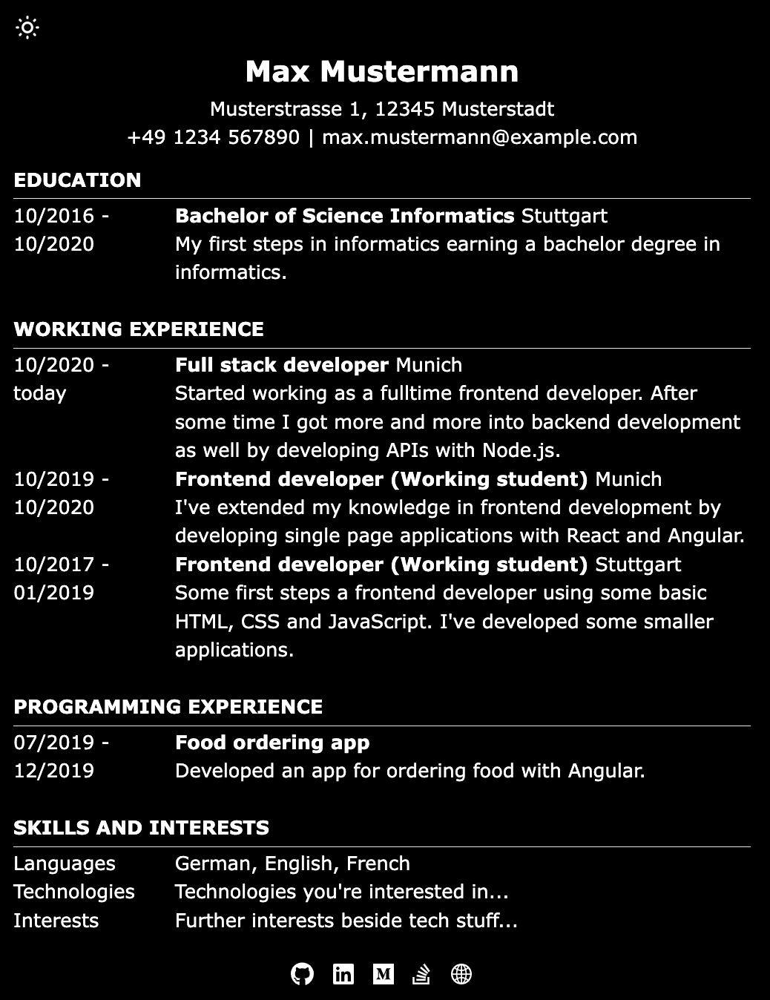

# Astro minimal CV

Template for a minimal CV with dark mode support. This CV is fully customizable and uses [`Tailwind`](https://tailwindcss.com). Furthermore, you can add your own social accounts using `astro-icon`.




## Commands

This application is built with `yarn`, but you're free to use any package management you want to.

```bash
# install all dependencies
$ yarn
# start dev server
$ yarn dev
# builds the app and publishes it into `dist` folder
$ yarn build
# preview the app that was built
$ yarn preview
# run astro commands
$ yarn astro ...
```

## Project structure

The project is structured in `components` and `pages`. Currently, only the index page is existing which contains all information about the CV.

In components, three main components are located. `RowEntry` is used for displaying a row in the table. `SectionTitle` provides the heading for a section containing one or more rows. And `SocialIcon` is used for displaying the social icons in the footer.
